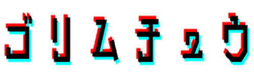

    

# 💻 開発環境
* Processing

# 🦍概要
ゴリラを駆逐し渋谷の治安を守るシューティングゲーム。ゴリラを12匹倒すと渋谷を荒らす張本人（ボス）が出現し，そいつを倒すとゲームクリアです。

# 👤キャラクター
| 画像| 名前 |説明
| ------------- | ------------- |------------- |
|  |ひろし |スポーツ万能なイケメン。戦闘力は53万でゴリラと互角に戦える。
|  |ゴリラ |上野動物園から逃げ出した野獣。
|  |組長|前髪だけでも十分に戦闘力があるやくざ。ひろしに個人的な恨みがある。

# 🍌アイテム

| 画像| 名前 |説明
| ------------- | ------------- |------------- |
|  |バナナ |栄養たっぷりのバナナ。ゴリラ駆逐時に60%の確率でドロップ。HPを5回復する。

# 🎮操作方法
### zボタン
ゲーム開始

### 右ボタン，左ボタン
左右移動

### スペースキー
ジャンプ。敵の接触から身を守ることができる。

### 下ボタン

敵を攻撃。

